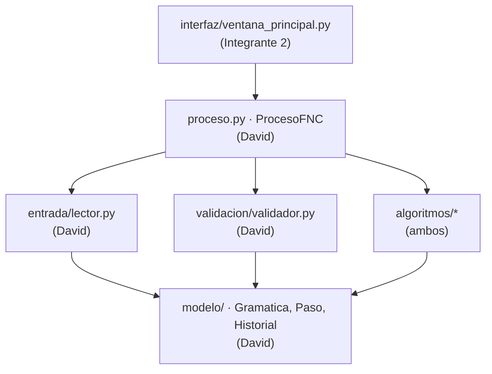
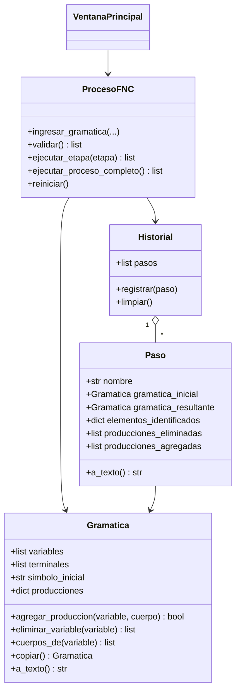

# Guía de trabajo del equipo: Microproyecto 1, Depuración y FNC

> **Documento interno y temporal.** Esta guía vive solo en esta rama. **No se fusiona con `main`** y **no se abre Pull Request desde esta rama.** Al terminar el proyecto se borra la rama (sección 16) y la guía desaparece del repositorio.

| | |
|---|---|
| **Integrante 1** | David Santiago Rincón Bautista |
| **Integrante 2** | __________________________ (escribir nombre) |
| **Materia** | Teoría de la Computación, Microproyecto #1 (2026/02) |
| **Entrega** | **30 de septiembre**, en NPLAD. Después, sustentación en la fecha programada |
| **Enunciado** | `MICROPROYECTO1-FNC (1).pdf` (rama `main`) |

**Índice:**
1. Resumen
2. Decisión tecnológica
3. Preparar el entorno
4. Estructura del proyecto
5. Contrato compartido (firmas que ambos respetan)
6. División del trabajo en detalle
7. Especificación de cada algoritmo
8. Gramáticas de prueba y resultados esperados
9. Matriz de trazabilidad (requisito → responsable)
10. Documento técnico y manual de usuario
11. Cronograma
12. Flujo de trabajo con Git
13. Ejecutable y paquete de entrega
14. Preparación de la sustentación
15. Checklist final
16. Al terminar: borrar esta guía

---

## 1. Resumen

**Qué construimos:** un aplicativo de escritorio (no web) en el que el usuario:
1. Ingresa una Gramática Libre de Contexto.
2. La valida.
3. La depura: producciones nulas, producciones unitarias, variables inútiles y variables inalcanzables.
4. La convierte a Forma Normal de Chomsky.

En cada etapa el aplicativo muestra la gramática antes y después y lo que se eliminó y agregó.

**Entregables (sección 13 del enunciado):**
1. Código fuente funcional y documentado.
2. Documento técnico.
3. Manual de usuario.
4. Además, el ejecutable `DepuradorFNC.exe` para correrlo en cualquier PC con Windows sin instalar nada.

**División en una tabla:**

| | David | Integrante 2 |
|---|---|---|
| **Código** | Modelo de datos, lectura y validación de la gramática, producciones **nulas** y **unitarias**, validación final de FNC, **controlador** del proceso | Variables **inútiles** e **inalcanzables**, **conversión a FNC** (terminales, producciones largas, variables auxiliares), **interfaz gráfica**, **ejecutable** |
| **Documento técnico** | Portada, introducción, planteamiento, objetivos, marco teórico (parte A), requerimientos, algoritmos de sus módulos, implementación, pruebas 1, 3, 4 y 8, resultados, conclusiones, referencias, **ensamblar el documento final** | Marco teórico (parte B), **diagramas** de análisis y diseño, algoritmos de sus módulos, pruebas 2, 5, 6 y 7 |
| **Manual de usuario** | Interpretación de resultados, mensajes de error, ejemplo completo | Presentación, requisitos, instalación y ejecución, ingreso de la gramática, validación, ejecución paso a paso y automática, **ensamblar el manual final** |
| **Carga estimada** | ≈ 24,5 h | ≈ 24,5 h |

**Regla principal:**
- Cada archivo tiene un solo dueño (sección 4).
- Las firmas que conectan el trabajo de los dos están fijadas en la sección 5.
- Con eso ambos pueden empezar **al mismo tiempo** sin esperarse ni pisarse.

---

## 2. Decisión tecnológica

**Python 3.11+ con Tkinter**, empaquetado con **PyInstaller**.

| Criterio | Python + Tkinter (elegido) | Java + Swing |
|---|---|---|
| Permitido por el enunciado | Sí | Sí |
| Ejecutar "en cualquier máquina con los archivos" | `.exe` de un solo archivo con PyInstaller: corre en Windows **sin instalar Python** | El `.jar` exige tener Java instalado |
| Dependencias externas | Ninguna (Tkinter y `unittest` vienen con Python) | Ninguna |
| Código de los algoritmos | Operaciones de conjuntos cortas y legibles | Bastante más código repetitivo |
| Correr desde el código fuente | `python main.py` en Windows, macOS o Linux | `javac` + `java` |

Menos código repetitivo significa más tiempo para los documentos y las pruebas, que pesan mucho en la nota.

---

## 3. Preparar el entorno (ambos, unos 20 minutos)

1. **Instalar Python 3.11 o superior** desde <https://www.python.org/downloads/>. En Windows:
   - Marcar **"Add python.exe to PATH"**.
   - En *Customize installation*, dejar marcado **"tcl/tk and IDLE"**, que es Tkinter.
2. **Verificar:**
   ```bat
   py --version
   py -m tkinter
   ```
   `py -m tkinter` debe abrir una ventanita de prueba. En macOS o Linux usen `python3` en lugar de `py`; en Linux quizá haga falta `sudo apt install python3-tk`.
3. **Acceso al repositorio:** David invita al Integrante 2 en GitHub, en *Settings → Collaborators → Add people*.
4. **Clonar:**
   ```bash
   git clone https://github.com/DavidRincon12/Microproyecto_FNC.git
   cd Microproyecto_FNC
   ```
5. **Identidad de Git.** Cada uno pone sus propios datos, con el correo de su cuenta de GitHub, para que cada commit quede a nombre de quien lo hizo:
   ```bash
   git config user.name  "Nombre Apellido"
   git config user.email "el-correo-de-su-cuenta-de-GitHub"
   ```
6. **Editor:** VS Code con la extensión *Python* (o el que prefieran).

---

## 4. Estructura del proyecto

```
Microproyecto_FNC/
├── main.py                        Integrante 2   Punto de entrada: abre la ventana
├── README.md                      Integrante 2   Descripción y cómo ejecutar (versión final)
├── .gitignore                     David
├── construir_exe.bat              Integrante 2   Genera dist/DepuradorFNC.exe
├── ejemplos/                      Integrante 2   Gramáticas de prueba (.txt) de la sección 8
│   ├── e1_nulas_unitarias.txt
│   ├── e2_inutiles_inalcanzables.txt
│   ├── e3_inicial_anulable.txt
│   ├── e4_expresiones.txt
│   ├── e5_varias_anulables.txt
│   ├── e6_nombres_unicos.txt
│   ├── e7_lenguaje_vacio.txt
│   └── e8_con_errores.txt
├── fnc/
│   ├── __init__.py
│   ├── modelo/
│   │   ├── __init__.py
│   │   ├── gramatica.py           David          Clase Gramatica
│   │   └── historial.py           David          Clases Paso e Historial
│   ├── entrada/
│   │   ├── __init__.py
│   │   └── lector.py              David          Lectura del texto ingresado y de archivos .txt
│   ├── validacion/
│   │   ├── __init__.py
│   │   └── validador.py           David          Validación inicial y validación de FNC
│   ├── algoritmos/
│   │   ├── __init__.py
│   │   ├── nulas.py               David
│   │   ├── unitarias.py           David
│   │   ├── inutiles.py            Integrante 2
│   │   ├── inalcanzables.py       Integrante 2
│   │   └── chomsky.py             Integrante 2
│   ├── proceso.py                 David          Controlador: orden de etapas, historial, reinicio
│   └── interfaz/
│       ├── __init__.py
│       └── ventana_principal.py   Integrante 2
└── pruebas/
    ├── test_gramatica.py          David
    ├── test_lector_validador.py   David
    ├── test_nulas.py              David
    ├── test_unitarias.py          David
    ├── test_proceso.py            David
    ├── test_inutiles.py           Integrante 2
    ├── test_inalcanzables.py      Integrante 2
    ├── test_chomsky.py            Integrante 2
    └── test_ejemplos.py           Integrante 2   Integración: E1 a E8 de principio a fin
```

**Arquitectura por capas.** Las dependencias solo van hacia abajo:



- La interfaz **solo** habla con `ProcesoFNC` y nunca llama a un algoritmo directamente.
- Los algoritmos no saben que la interfaz existe. Así cada parte se prueba por separado.

**Comandos** (desde la raíz del repo):

| Acción | Windows | macOS / Linux |
|---|---|---|
| Ejecutar | `py main.py` | `python3 main.py` |
| Correr todas las pruebas | `py -m unittest discover -s pruebas -v` | `python3 -m unittest discover -s pruebas -v` |

---

## 5. Contrato compartido

> Esto es lo que permite trabajar en paralelo. **Nadie cambia una firma de esta sección sin avisar al otro.** Lo interno de cada función lo decide su dueño.

### 5.1 Convenciones de la gramática de entrada

| Elemento | Regla | Ejemplos válidos |
|---|---|---|
| Variables | Separadas por comas o espacios. Empiezan con **letra mayúscula**, seguida opcionalmente de dígitos o apóstrofos | `S, A, B`, `S A B1 C'` |
| Terminales | Separados por comas o espacios. **No** empiezan con mayúscula | `a, b`, `0 1`, `+ * ( ) id` |
| Símbolo inicial | Una de las variables declaradas | `S` |
| Producciones | Una o varias líneas `A -> α1 \| α2 \| ...`. También se acepta `→`. Una misma variable puede aparecer en varias líneas y se juntan. Se ignoran las líneas vacías y las que empiezan con `#` | `S -> aSb \| ab` |
| Cadena vacía | `ε`, `λ` o `eps`, y **siempre sola** en su alternativa | `A -> aA \| ε` |
| Palabras reservadas | `ε`, `λ`, `eps`, `->`, `→`, `\|` y `,` no pueden declararse como símbolos | |

**Lectura del lado derecho (tokenización):**
1. Se separa por espacios.
2. Cada trozo se parte tomando siempre **el símbolo declarado más largo** que coincida.
   - Con `V = {S, X1}` y `T = {a, b}`, `aX1b` se lee como `a X1 b`, y `a X1 b` también.
3. Si en una posición no coincide ningún símbolo declarado:
   - Si empieza con mayúscula, se toma la mayúscula más los dígitos o apóstrofos que la sigan como **variable no declarada**.
   - Si no, se toma un carácter como **terminal no declarado**.
   - En ambos casos queda registrado para el mensaje de error (sección 7.1).

**Representación interna:**
- Un cuerpo de producción es una **tupla de strings**: `S -> a S b` es `("a", "S", "b")`.
- **ε es la tupla vacía `()`.** El carácter `ε` solo se usa al mostrar.

**Formato de archivo `.txt`** (para `ejemplos/`, "Abrir" y "Guardar"):

```
# E1: producciones nulas y unitarias
VARIABLES: S, A, B
TERMINALES: a, b
INICIAL: S
PRODUCCIONES:
S -> ASA | aB
A -> B | S
B -> b | ε
```

### 5.2 `fnc/modelo/gramatica.py` (dueño: David)

```python
EPSILON = "ε"  # solo para mostrar; internamente ε es la tupla vacía ()

Cuerpo = tuple[str, ...]
Produccion = tuple[str, Cuerpo]          # ("S", ("a", "S", "b"))


class Gramatica:
    """G = (V, T, P, S). Las producciones se guardan en sets para no duplicarlas (RNF08)."""

    def __init__(self, variables: list[str], terminales: list[str], simbolo_inicial: str) -> None:
        self.variables: list[str]                       # orden de declaración; las auxiliares se agregan al final
        self.terminales: list[str]
        self.simbolo_inicial: str
        self.producciones: dict[str, set[Cuerpo]]       # variable -> conjunto de cuerpos

    # --- consultas ---
    def es_variable(self, simbolo: str) -> bool: ...
    def es_terminal(self, simbolo: str) -> bool: ...
    def variables_en_orden(self) -> list[str]:
        """El símbolo inicial primero y luego el resto en el orden de self.variables."""
    def cuerpos_de(self, variable: str) -> list[Cuerpo]:
        """Cuerpos de la variable en ORDEN CANÓNICO: sorted(cuerpos, key=lambda c: (len(c), c))."""
    def lista_producciones(self) -> list[Produccion]:
        """Todas las producciones: variables_en_orden() y, dentro de cada una, cuerpos_de()."""
    def cantidad_producciones(self) -> int: ...

    # --- modificaciones ---
    def agregar_variable(self, variable: str) -> None: ...        # la agrega al final si no existe
    def definir_simbolo_inicial(self, variable: str) -> None: ...
    def agregar_produccion(self, variable: str, cuerpo: Cuerpo) -> bool:
        """Devuelve False si la producción ya existía (así se detectan duplicados)."""
    def eliminar_produccion(self, variable: str, cuerpo: Cuerpo) -> bool: ...
    def eliminar_variable(self, variable: str) -> list[Produccion]:
        """Quita la variable, sus producciones y TODA producción que la use en el lado derecho.
        Devuelve la lista de producciones eliminadas (en orden canónico)."""
    def eliminar_terminal(self, terminal: str) -> None: ...
    def copiar(self) -> "Gramatica":
        """Copia profunda: modificar la copia no afecta al original."""

    # --- presentación ---
    @staticmethod
    def cuerpo_a_texto(cuerpo: Cuerpo) -> str: ...                # ("a","S","b") -> "a S b";  () -> "ε"
    @staticmethod
    def produccion_a_texto(variable: str, cuerpo: Cuerpo) -> str: ...  # "S -> a S b"
    def a_texto(self) -> str: ...
```

`a_texto()` produce **exactamente** este formato:
- Una línea de P por cada variable que tenga producciones.
- Las variables van en el orden de `variables_en_orden()` y los cuerpos en el de `cuerpos_de()`.
- Los símbolos se separan con un espacio.

```
V = {S, A, B}
T = {a, b}
Inicial = S
P:
  S -> a | A S | S A | a B | A S A
  A -> B | S
  B -> b
```

### 5.3 `fnc/modelo/historial.py` (dueño: David)

```python
from dataclasses import dataclass, field


@dataclass
class Paso:
    """Una etapa del proceso con todo lo que exige RF18."""
    nombre: str                                     # "Eliminación de producciones nulas"
    gramatica_inicial: Gramatica                    # copia de la gramática ANTES de la etapa
    gramatica_resultante: Gramatica                 # gramática DESPUÉS de la etapa
    elementos_identificados: dict[str, list[str]] = field(default_factory=dict)
    #   ej.: {"Variables anulables": ["A", "B"]}
    producciones_eliminadas: list[Produccion] = field(default_factory=list)
    producciones_agregadas: list[Produccion] = field(default_factory=list)
    observaciones: list[str] = field(default_factory=list)
    numero: int = 0                                 # lo asigna Historial.registrar()

    def a_texto(self) -> str: ...


class Historial:
    """Registro completo de pasos (sección 9 del enunciado, RNF10)."""

    def __init__(self) -> None:
        self.pasos: list[Paso] = []

    def registrar(self, paso: Paso) -> None: ...    # asigna paso.numero = len(self.pasos) + 1
    def limpiar(self) -> None: ...
    def esta_vacio(self) -> bool: ...
    def a_texto(self) -> str: ...                   # todos los pasos, uno tras otro
```

Formato de `Paso.a_texto()`:

```
============================================================
Paso 2. Eliminación de producciones nulas
============================================================
Gramática inicial de la etapa:
  S -> a B | A S A
  A -> B | S
  B -> ε | b
Elementos identificados:
  Variables anulables: A, B
Producciones eliminadas:
  - B -> ε
Producciones agregadas:
  + S -> a
  + S -> A S
  + S -> S A
Observaciones:
  S no es anulable: no se crea un nuevo símbolo inicial.
Gramática resultante:
  S -> a | A S | S A | a B | A S A
  A -> B | S
  B -> b
```

Si una lista está vacía se escribe `(ninguna)`.

### 5.4 Funciones de los algoritmos

Todas reciben una `Gramatica`, **no la modifican** y devuelven un `Paso` cuya `gramatica_resultante` es una gramática nueva.

```python
# fnc/algoritmos/nulas.py               (David)
def calcular_variables_anulables(gramatica: Gramatica) -> list[str]: ...                 # RF07
def eliminar_producciones_nulas(gramatica: Gramatica) -> Paso: ...                       # RF08

# fnc/algoritmos/unitarias.py           (David)
def encontrar_producciones_unitarias(gramatica: Gramatica) -> list[Produccion]: ...     # RF09
def calcular_pares_unitarios(gramatica: Gramatica) -> list[tuple[str, str]]: ...
def eliminar_producciones_unitarias(gramatica: Gramatica) -> Paso: ...                   # RF10

# fnc/algoritmos/inutiles.py            (Integrante 2)
def calcular_variables_generadoras(gramatica: Gramatica) -> list[str]: ...              # RF11
def eliminar_variables_inutiles(gramatica: Gramatica) -> Paso: ...                       # RF12

# fnc/algoritmos/inalcanzables.py       (Integrante 2)
def calcular_variables_alcanzables(gramatica: Gramatica) -> list[str]: ...              # RF13
def eliminar_variables_inalcanzables(gramatica: Gramatica) -> Paso: ...                  # RF14

# fnc/algoritmos/chomsky.py             (Integrante 2)
def generar_nombre_auxiliar(gramatica: Gramatica, prefijo: str = "X") -> str: ...       # RF17, RNF09
def sustituir_terminales(gramatica: Gramatica) -> Paso: ...                              # RF15
def reducir_producciones_largas(gramatica: Gramatica) -> Paso: ...                       # RF16

# fnc/validacion/validador.py           (David)
def validar_fnc(gramatica: Gramatica) -> list[str]: ...          # RNF12. [] = cumple la FNC

# fnc/entrada/lector.py                 (David) - la interfaz lo usa para abrir y guardar archivos
def leer_archivo(ruta: str) -> dict[str, str]: ...
    # {"variables": "S, A", "terminales": "a, b", "inicial": "S", "producciones": "S -> ...\nA -> ..."}
    # Lanza ValueError con un mensaje claro si el archivo no tiene el formato de la sección 5.1.
def guardar_archivo(ruta: str, datos: dict[str, str]) -> None: ...
```

### 5.5 `fnc/proceso.py`: controlador (dueño: David, lo usa el Integrante 2)

```python
ETAPAS = ("nulas", "unitarias", "inutiles", "inalcanzables", "fnc")

NOMBRES_ETAPAS = {
    "nulas": "Eliminar producciones nulas",
    "unitarias": "Eliminar producciones unitarias",
    "inutiles": "Eliminar variables inútiles",
    "inalcanzables": "Eliminar variables inalcanzables",
    "fnc": "Convertir a Forma Normal de Chomsky",
}


class ErrorProceso(Exception):
    """Error cuyo mensaje ya está listo para mostrárselo al usuario."""


class ProcesoFNC:
    def ingresar_gramatica(self, texto_variables: str, texto_terminales: str,
                           texto_inicial: str, texto_producciones: str) -> None:
        """RF01-RF05. Guarda el texto ingresado y reinicia cualquier proceso anterior."""

    def validar(self) -> list[str]:
        """RF06. Lee y valida lo ingresado. Devuelve la lista de errores ([] = válida).
        Si es válida, registra el paso 'Validación de la gramática' en el historial."""

    def gramatica_es_valida(self) -> bool: ...
    def siguiente_etapa(self) -> str | None: ...        # clave de ETAPAS o None si terminó
    def ejecutar_etapa(self, etapa: str) -> list[Paso]:
        """Modo paso a paso. Lanza ErrorProceso si la gramática no está validada,
        si la etapa no es la siguiente o si el lenguaje resultó vacío."""
    def ejecutar_proceso_completo(self) -> list[Paso]:
        """Modo automático: valida si hace falta y ejecuta TODAS las etapas pendientes."""
    def proceso_terminado(self) -> bool: ...
    def gramatica_original(self) -> Gramatica | None: ...     # None si aún no se ha validado
    def gramatica_actual(self) -> Gramatica | None: ...
    def gramatica_final(self) -> Gramatica | None: ...        # None si la etapa "fnc" no ha corrido
    def historial(self) -> Historial: ...
    def reiniciar(self) -> None: ...                          # RF20
```

### 5.6 Reglas de oro (ambos)

1. **Los algoritmos no modifican la gramática que reciben.** Trabajan sobre `gramatica.copiar()`.
2. **Nunca recorrer un `set` directamente cuando el orden afecte el resultado.** Usar `variables_en_orden()`, `cuerpos_de()` o `sorted(...)`.
   - Python cambia el orden de los sets de strings entre una ejecución y otra.
   - Si no se ordena, los nombres `X1, X2...` pueden salir distintos cada vez, y eso incumple el **RNF11** (resultado reproducible).
3. Las producciones se agregan **solo** con `agregar_produccion`, que evita los duplicados (**RNF08**).
4. Cada función pública lleva **docstring**, y los pasos principales del algoritmo van **comentados** (**RNF05**).
5. **Nombres en español y descriptivos** (**RNF04**): `calcular_variables_anulables`, no `calc_n`.
6. **Nada de código copiado** de otros equipos o de repositorios públicos. El enunciado anula los proyectos semejantes. El diseño de la ventana, los textos y los comentarios son nuestros.

---

## 6. División del trabajo en detalle

Las horas son estimadas y sirven para ver que la carga es pareja.

### 6.1 David: núcleo, entrada, validación, nulas, unitarias y controlador

**Código (≈ 13 h)**

| # | Tarea | Archivo | Requisitos | Horas | Listo cuando... |
|---|---|---|---|---|---|
| D1 | Estructura inicial: carpetas, `__init__.py` y `.gitignore` (sección 13) | varias | RNF03 | 0,5 | Está en `main` y el Integrante 2 puede importar `fnc` |
| D2 | Clase `Gramatica` | `modelo/gramatica.py` | RF01–RF05, RNF08, RNF11 | 1,5 | `a_texto()` produce el formato de la 5.2 y `copiar()` es independiente |
| D3 | `Paso` e `Historial` | `modelo/historial.py` | RF18, RNF10, sec. 9 | 0,5 | `Paso.a_texto()` produce el formato de la 5.3 |
| D4 | Lector del texto y de archivos | `entrada/lector.py` | RF01–RF05 | 1,5 | Tokeniza como la 5.1 y `leer_archivo` abre todos los `ejemplos/` |
| D5 | Validación inicial con todos los mensajes | `validacion/validador.py` | RF06, sec. 8, RNF02 | 1,5 | E8 produce los 3 errores esperados (sección 8) |
| D6 | Eliminación de producciones nulas | `algoritmos/nulas.py` | RF07, RF08, RNF07 | 2,5 | E1, E3 y E5 coinciden en la etapa de nulas |
| D7 | Eliminación de producciones unitarias | `algoritmos/unitarias.py` | RF09, RF10 | 1,5 | E1, E3, E4 y E5 coinciden en la etapa de unitarias |
| D8 | `validar_fnc` | `validacion/validador.py` | RNF12 | 0,5 | Acepta las gramáticas finales de E1–E6 y rechaza `A -> a B`, `A -> B` y `A -> B C D` |
| D9 | Controlador `ProcesoFNC` | `proceso.py` | RF18–RF20, sec. 12 (modos) | 1,5 | El modo paso a paso respeta el orden y el automático corre todo |
| D10 | Pruebas de sus módulos | `pruebas/test_*.py` (suyos) | | 1,5 | Todas en verde |
| — | *Opcional si sobra tiempo:* menú de consola idéntico al de la sección 12 del enunciado (`py main.py --consola`) | `fnc/interfaz/consola.py` | sec. 12 | | |

**Documentos (≈ 11,5 h):** ver la tabla de la sección 10.

### 6.2 Integrante 2: inútiles, inalcanzables, FNC, interfaz y ejecutable

**Código (≈ 13 h)**

| # | Tarea | Archivo | Requisitos | Horas | Listo cuando... |
|---|---|---|---|---|---|
| C1 | Archivos de ejemplo E1–E8 (copiar de la sección 8) | `ejemplos/*.txt` | RNF06 | 0,5 | Los 8 archivos existen con el formato de la 5.1 |
| C2 | Variables generadoras y eliminación de inútiles | `algoritmos/inutiles.py` | RF11, RF12 | 1,5 | E2 y E7 coinciden en la etapa de inútiles |
| C3 | Variables alcanzables y eliminación de inalcanzables | `algoritmos/inalcanzables.py` | RF13, RF14 | 1 | E2 coincide en la etapa de inalcanzables |
| C4 | Nombres auxiliares, sustitución de terminales y reducción de largas | `algoritmos/chomsky.py` | RF15–RF17, RNF09 | 2,5 | E1 y E3–E6 coinciden en las dos etapas de FNC |
| C5 | Interfaz gráfica completa (sección 7.11) | `interfaz/ventana_principal.py` | RNF01, RNF02, RF18–RF20, sec. 12 | 5 | Se puede hacer todo el menú del enunciado desde la ventana |
| C6 | `main.py`, `README.md` final, `construir_exe.bat` y generar y probar el `.exe` en otro PC | varios | | 1 | El `.exe` abre en un PC sin Python y carga los ejemplos |
| C7 | Pruebas de sus módulos más la **prueba de integración** `test_ejemplos.py` (E1–E8 de principio a fin, dos veces seguidas para comprobar el RNF11) | `pruebas/` | RNF06, RNF11, RNF12 | 1,5 | Todas en verde |

**Documentos (≈ 11,5 h):** ver la tabla de la sección 10.

### 6.3 Tareas compartidas

- **Revisión cruzada (1 h cada uno), el 30 de septiembre en la mañana.** Cada uno lee el código del otro y le pregunta lo que no entienda.
  - David revisa `inutiles.py`, `inalcanzables.py`, `chomsky.py` y la interfaz.
  - El Integrante 2 revisa `nulas.py`, `unitarias.py`, `validador.py` y `proceso.py`.
  - En la sustentación **cualquiera** puede recibir preguntas sobre cualquier parte.
- **Ensayo de sustentación** juntos (sección 14).
- **Probar el `.exe` final** en un PC distinto a los de desarrollo.

### 6.4 Cómo empezar en paralelo desde el primer minuto

- **Integrante 2, algoritmos:** no necesita esperar el lector de David. En sus pruebas puede construir las gramáticas a mano con la clase `Gramatica`:
  ```python
  g = Gramatica(["S", "A", "B"], ["a", "b"], "S")
  g.agregar_produccion("S", ("A", "B"))
  g.agregar_produccion("S", ("a",))
  ```
  Mientras David sube la clase real (hito H1), puede ir escribiendo las funciones contra las firmas de la sección 5.
- **Integrante 2, interfaz:** puede armar la ventana completa (campos, botones, pestañas) antes de que exista `ProcesoFNC`, y conectarla cuando David lo suba. Si usa algún objeto falso temporal para probar, se borra antes de fusionar.
- **David:** empieza por D1, D2 y D3 y los sube a `main` cuanto antes, porque todo depende de ellos.

---

## 7. Especificación de cada algoritmo

El orden de las etapas es fijo y es el del menú del enunciado: **nulas → unitarias → inútiles → inalcanzables → FNC** (la razón está en la sección 14).

### 7.1 Lectura y validación inicial (David)

La gramática **no puede pasar a ninguna etapa** mientras tenga errores (sección 8 del enunciado).

- Se muestran **todos** los errores a la vez, no solo el primero.
- Los textos son exactamente estos (RNF02):

| Código | Situación | Mensaje |
|---|---|---|
| V01 | No hay variables | `Error: debe declarar al menos una variable.` |
| V02 | No hay terminales | `Error: debe declarar al menos un terminal.` |
| V03 | No hay símbolo inicial | `Error: debe indicar el símbolo inicial.` |
| V04 | El inicial no está en V | `Error: el símbolo inicial X no pertenece al conjunto de variables.` |
| V05 | Variable con formato inválido | `Error: la variable 'ab' no es válida; las variables deben iniciar con letra mayúscula (ej.: S, A, B1).` |
| V06 | Terminal con formato inválido o reservado | `Error: el terminal 'A' no es válido; los terminales no pueden iniciar con mayúscula ni ser ε, λ o eps.` |
| V07 | Símbolo en V y en T a la vez | `Error: el símbolo a fue declarado como variable y como terminal.` |
| V08 | No hay producciones | `Error: debe registrar al menos una producción.` |
| V09 | Línea sin `->` | `Error: la línea 3 ('S = aB') no tiene el símbolo '->'.` |
| V10 | Lado izquierdo inválido | `Error: el lado izquierdo de la producción 'aB -> b' no es una variable declarada.` |
| V11 | Alternativa vacía | `Error: la producción 'S -> a \| \| b' tiene una alternativa vacía; use ε para la cadena vacía.` |
| V12 | ε mezclada con otros símbolos | `Error: en la producción S -> aεb, ε debe aparecer sola.` |
| V13 | Terminal no declarado | `Error: el símbolo c no fue declarado como terminal.` |
| V14 | Variable no declarada | `Error: la variable D utilizada en la producción S -> AD no fue declarada.` |

- En V13 y V14 la producción se muestra **tal como la escribió el usuario** (`S -> AD`).
- Advertencia que **no bloquea** el proceso: `Advertencia: la variable C no tiene producciones.`

### 7.2 Eliminación de producciones nulas (David): RF07, RF08, RNF07

1. **Variables anulables (punto fijo):**
   - Empezar con N = {A | existe A → ε}.
   - Repetir: agregar A a N si existe A → X1…Xk con **todos** los Xi en N.
   - Parar cuando una vuelta no agregue nada.
   - Reportarlas en el orden de `variables_en_orden()`.
2. **Recorrer cada variable A** (en orden) y **cada cuerpo** (en orden canónico):
   - Si el cuerpo es ε, se **elimina** y se registra.
   - Si no, sean p1…pk las posiciones del cuerpo con símbolos anulables. Se generan las 2^k combinaciones de quitar o conservar esos símbolos.
   - Se descarta el resultado vacío y se descarta `A -> A`, que no aporta nada.
   - El resto se agrega (el set evita repetidos). Las que no existían se registran como **agregadas**.
3. **Tratamiento especial de ε (RNF07).** Si el símbolo inicial S es anulable, ε pertenece al lenguaje:
   - Se crea un **nuevo inicial** con el nombre del inicial más un `0` (para S es `S0`). Si ese nombre ya existe, se le agregan `'` hasta que quede libre.
   - Se le dan las producciones `S0 -> S | ε`, y `S0` pasa a ser el símbolo inicial.
   - Así la gramática conserva la cadena vacía. `S0` nunca aparece a la derecha, por lo que `S0 -> ε` es la única producción ε permitida en la FNC.
   - Se deja esta observación: *"S es anulable, por lo tanto ε ∈ L(G). Se crea el nuevo símbolo inicial S0 con S0 -> S | ε para conservar la cadena vacía."*
4. **Paso:**
   - `nombre = "Eliminación de producciones nulas"`
   - `elementos_identificados = {"Variables anulables": [...]}`
   - Si no hay anulables: observación *"La gramática no tiene producciones nulas; no hay cambios."*

### 7.3 Eliminación de producciones unitarias (David): RF09, RF10

1. **Unitarias:** son las producciones A → B con B variable, es decir, cuerpo de longitud 1 que es una variable.
2. **Cadena unitaria de cada A** (en orden):
   - Empezar con `cadena = [A]`.
   - Recorrer en anchura: por cada X de la cadena y cada cuerpo de X en orden canónico que sea unitario `X -> Y` con Y aún no incluida, agregar Y al final.
   - Los **pares unitarios** son (A, Y) para cada Y ≠ A de la cadena.
3. **Nuevos cuerpos de A:** todos los cuerpos **no unitarios** de todas las variables de la cadena, incluida la propia A.
4. **Resultado:**
   - Se eliminan todas las unitarias, incluida `A -> A` si existiera. Se registran como eliminadas.
   - Los cuerpos que no existían se registran como agregados.
   - `S0 -> ε` no es unitaria y se conserva.
5. **Paso:**
   - `nombre = "Eliminación de producciones unitarias"`
   - `elementos_identificados = {"Producciones unitarias": [...], "Pares unitarios": ["(A, B)", ...]}`

### 7.4 Eliminación de variables inútiles (Integrante 2): RF11, RF12

1. **Generadoras (punto fijo):**
   - A es generadora si existe A → α donde **cada** símbolo de α es un terminal o una variable ya marcada como generadora.
   - `A -> ε` cuenta como generadora, porque ε es una cadena de terminales.
   - Repetir hasta que no cambie.
2. **No generadoras** = V − generadoras. Son las inútiles.
3. Eliminar cada no generadora con `eliminar_variable`, que borra también las producciones que la usan. Todo lo borrado se registra.
4. **Lenguaje vacío.** Si el símbolo inicial **no** es generador, L(G) = ∅:
   - Se deja la observación *"El símbolo inicial S no genera ninguna cadena de terminales: el lenguaje es vacío. El proceso no puede continuar."*
   - El controlador detiene las etapas siguientes.
5. **Paso:**
   - `nombre = "Eliminación de variables inútiles"`
   - `elementos_identificados = {"Variables generadoras": [...], "Variables no generadoras (inútiles)": [...]}`

### 7.5 Eliminación de variables inalcanzables (Integrante 2): RF13, RF14

1. **Alcanzables, recorrido en anchura:**
   - Empezar con `cola = [S]`.
   - Por cada variable de la cola y cada cuerpo en orden canónico, agregar al final toda variable del cuerpo que no se haya visitado.
   - Se reportan en el orden en que se descubren.
2. **Inalcanzables** = V − alcanzables. Se eliminan con sus producciones.
3. Los **terminales** que ya no aparecen en ninguna producción se quitan de T y se reportan.
4. **Paso:**
   - `nombre = "Eliminación de variables inalcanzables"`
   - `elementos_identificados = {"Variables alcanzables": [...], "Variables inalcanzables": [...], "Terminales que dejan de usarse": [...]}`

### 7.6 Nombres de variables auxiliares (Integrante 2): RF17, RNF09

`generar_nombre_auxiliar(g, "X")`:
1. Probar `X1`, `X2`, `X3`… y devolver el **primero que no esté** ni en las variables ni en los terminales de `g`.
2. Cada auxiliar se agrega a la gramática **en el momento de crearla**, para que la siguiente llamada devuelva el nombre siguiente.
3. Por eso, si el usuario ya declaró `X1`, el primero en crearse será `X2` (ver E6).

### 7.7 Sustitución de terminales (Integrante 2): RF15

1. Recorrer `variables_en_orden()`, tomada **antes** de empezar, y cada cuerpo en orden canónico.
2. Solo se transforman los cuerpos de **longitud ≥ 2** que tengan algún terminal:
   - Cada terminal `a` se reemplaza por su variable auxiliar.
   - Si `a` aún no tiene auxiliar, se crea `Xn -> a` y se guarda en un diccionario `terminal → variable` para **reutilizarla** en el resto de la gramática.
3. La producción vieja se registra como eliminada y la nueva como agregada.
4. `A -> a` (longitud 1) y `S0 -> ε` no se tocan.
5. **Paso:**
   - `nombre = "FNC (1/2): sustitución de terminales"`
   - `elementos_identificados = {"Terminales sustituidos": ["a → X1", ...]}`

### 7.8 Reducción de producciones largas (Integrante 2): RF16

1. Recorrer `variables_en_orden()`, tomada **antes** de empezar, y cada cuerpo en orden canónico.
2. Para cada cuerpo `B1 B2 … Bn` con **n ≥ 3**:
   - Eliminar `A -> B1 … Bn`.
   - Hacer `actual = A`. Para i = 1 … n−2, sea `sufijo = B(i+1) … Bn`:
     - Si ese **sufijo ya tiene auxiliar Y** (diccionario `sufijo → variable`): agregar `actual -> Bi Y` y **terminar**. Así se reutiliza lo ya creado.
     - Si no: crear Y con un nombre nuevo, guardar `sufijo → Y`, agregar `actual -> Bi Y` y hacer `actual = Y`.
   - Si no se reutilizó nada, al final agregar `actual -> B(n−1) Bn`.
3. **Ejemplo:** `A -> B C D E` queda como `A -> B X1`, `X1 -> C X2`, `X2 -> D E`.
4. **Paso:**
   - `nombre = "FNC (2/2): reducción de producciones largas"`
   - `elementos_identificados = {"Variables auxiliares creadas": ["X2 = S A", ...]}`

### 7.9 Validación de la FNC (David): RNF12

Toda producción debe ser de una de estas formas:
- `A -> B C`, con B y C variables.
- `A -> a`, con a terminal.
- `S -> ε`, **solo** si S es el símbolo inicial y **no aparece** en el lado derecho de ninguna producción.

`validar_fnc` devuelve un mensaje por cada producción que no cumpla, por ejemplo:
- `La producción A -> a B no cumple la FNC: un cuerpo de longitud 2 debe tener dos variables.`
- `La producción A -> B no cumple la FNC: es una producción unitaria.`
- `La producción A -> B C D no cumple la FNC: tiene más de dos símbolos.`
- `La producción A -> ε no cumple la FNC: solo el símbolo inicial puede producir ε y no debe aparecer a la derecha.`

### 7.10 Controlador `ProcesoFNC` (David)

**Etapas:**
- Mantiene la gramática original, la actual, el historial y el índice de la siguiente etapa.
- `validar()` registra el paso **"Validación de la gramática"**, con `elementos_identificados`:
  - `"Variables (no terminales)"`
  - `"Terminales"`
  - `"Símbolo inicial"`
  - `"Número de producciones"`
  - Esto cubre los objetivos específicos *identificar terminales, no terminales y símbolo inicial*.
- `ejecutar_etapa("fnc")` ejecuta en orden:
  1. `sustituir_terminales`
  2. `reducir_producciones_largas`
  3. Un paso **"Validación de la Forma Normal de Chomsky"**, con el resultado de `validar_fnc`: `{"Resultado": ["La gramática cumple la FNC"]}` o la lista de fallas.
- Cada `Paso` devuelto se registra en el historial **antes** de retornarlo.

**Mensajes de `ErrorProceso`:**

| Situación | Mensaje |
|---|---|
| Sin validar | `Primero debe validar la gramática.` |
| Etapa fuera de orden | `Primero debe ejecutar: Eliminar producciones unitarias.` |
| Proceso terminado | `El proceso ya terminó. Use "Nueva gramática" para empezar otra.` |
| Lenguaje vacío | `El lenguaje de la gramática es vacío; no es posible continuar.` |

- `ejecutar_proceso_completo()` sirve también si ya se hicieron algunas etapas a mano: continúa desde `siguiente_etapa()`.
- `reiniciar()` borra todo: gramática, historial y etapa.

### 7.11 Interfaz gráfica (Integrante 2): RNF01

**Ventana:**
- Título: *"Depuración y Forma Normal de Chomsky"*.
- Tamaño mínimo aproximado de 1000 × 650. Debe poder redimensionarse.

**Panel izquierdo, "Gramática de entrada":**
- Campo **Variables** (RF02) y campo **Terminales** (RF03).
- Lista desplegable **Símbolo inicial** (`ttk.Combobox`, RF04). Se llena sola con las variables escritas.
- Área de texto **Producciones** (RF05), con fuente monoespaciada.
- Botones: **Insertar ε**, **Cargar ejemplo…** (E1–E8), **Abrir archivo…** y **Guardar…** (con `leer_archivo` y `guardar_archivo`).
- Una línea de ayuda con el formato: `S -> aSb | ε   (variables en MAYÚSCULA, terminales en minúscula)`.

**Panel de acciones.** Mismo orden y numeración que el menú del enunciado:

| Opción (sec. 12 del enunciado) | En la interfaz | Llama a |
|---|---|---|
| 1. Ingresar gramática | Botón **Registrar gramática** | `ingresar_gramatica(...)` |
| 2. Mostrar gramática original | Botón **Gramática original** | `gramatica_original()` |
| 3. Validar gramática | Botón **Validar** | `validar()` |
| 4. Eliminar producciones nulas | Botón **4. Nulas** | `ejecutar_etapa("nulas")` |
| 5. Eliminar producciones unitarias | Botón **5. Unitarias** | `ejecutar_etapa("unitarias")` |
| 6. Eliminar variables inútiles | Botón **6. Inútiles** | `ejecutar_etapa("inutiles")` |
| 7. Eliminar variables inalcanzables | Botón **7. Inalcanzables** | `ejecutar_etapa("inalcanzables")` |
| 8. Convertir a FNC | Botón **8. Convertir a FNC** | `ejecutar_etapa("fnc")` |
| 9. Ejecutar proceso completo | Botón **Proceso completo (automático)** | `ejecutar_proceso_completo()` |
| 10. Mostrar historial | Pestaña **Historial** | `historial()` |
| 11. Mostrar gramática final | Pestaña **Gramática final** | `gramatica_final()` |
| 12. Ingresar nueva gramática | Botón **Nueva gramática** (pide confirmación) | `reiniciar()` y limpiar los campos |
| 13. Salir | Botón **Salir** (pide confirmación) | cerrar la ventana |

**Panel derecho, un `ttk.Notebook` con tres pestañas:**
- **Resultado del paso:** muestra el último paso o los últimos pasos.
- **Historial:** muestra todos los pasos.
- **Gramática final:** muestra la gramática final y el resultado de la validación FNC.
- En las tres el texto es de solo lectura y usa fuente monoespaciada.
- Colores con *tags* de `Text`: producciones eliminadas en **rojo** con `-`, agregadas en **verde** con `+`, títulos en **negrita**.

**Comportamiento:**
- Los errores de validación se muestran en un `messagebox.showerror`, con la lista completa, y también en la pestaña de resultado.
- Los botones 4–8 permanecen **deshabilitados** hasta validar. Después solo se habilita el de `siguiente_etapa()`, y una etiqueta indica *"Siguiente etapa: ..."*. Esto es el **modo paso a paso**. El botón 9 es el **modo automático**.
- Si el usuario **edita los campos** después de registrar, se vuelve a llamar a `ingresar_gramatica` (el proceso se reinicia) y los botones de etapas se deshabilitan hasta validar de nuevo.
- Una barra de estado abajo muestra lo último que pasó: *"Gramática válida"*, *"Etapa ejecutada: ..."*, etc.
- **Ruta de los ejemplos dentro del `.exe`:** usar esta función para leer `ejemplos/`, que funciona tanto con `py main.py` como con el ejecutable:
  ```python
  def ruta_recurso(relativa: str) -> str:
      base = getattr(sys, "_MEIPASS", os.path.dirname(os.path.abspath(sys.argv[0])))
      return os.path.join(base, relativa)
  ```

---

## 8. Gramáticas de prueba y resultados esperados

**Cómo usarlas:**
- Sirven para tres cosas:
  1. Las **pruebas automáticas** de cada módulo.
  2. La prueba de integración `test_ejemplos.py`.
  3. La sección de **Pruebas** del documento técnico.
- Si ambos implementan la sección 7 al pie de la letra, los resultados deben coincidir **exactamente**, incluidos los nombres `X1, X2...`.
- En las pruebas, comparen las **producciones** (`lista_producciones()` o las líneas de `P`).
- Los resultados finales de E1 a E6 se verificaron: generan el mismo lenguaje que la gramática original.

### E1: producciones nulas y unitarias (prueba 1 del documento, David)

```
VARIABLES: S, A, B
TERMINALES: a, b
INICIAL: S
PRODUCCIONES:
S -> ASA | aB
A -> B | S
B -> b | ε
```

| Etapa | Identificado | Eliminadas | Agregadas |
|---|---|---|---|
| Nulas | Anulables: A, B (S **no** es anulable, no se crea S0) | `B -> ε` | `S -> a`, `S -> A S`, `S -> S A` |
| Unitarias | `A -> B`, `A -> S`; pares (A, B), (A, S) | `A -> B`, `A -> S` | `A -> a`, `A -> b`, `A -> A S`, `A -> S A`, `A -> a B`, `A -> A S A` |
| Inútiles | Generadoras: S, A, B | (ninguna) | (ninguna) |
| Inalcanzables | Alcanzables: S, A, B | (ninguna) | (ninguna) |
| Terminales | a → X1 | `S -> a B`, `A -> a B` | `X1 -> a`, `S -> X1 B`, `A -> X1 B` |
| Largas | X2 = S A | `S -> A S A`, `A -> A S A` | `S -> A X2`, `X2 -> S A`, `A -> A X2` |

Después de nulas:
```
S -> a | A S | S A | a B | A S A
A -> B | S
B -> b
```
Final (FNC):
```
S -> a | A S | A X2 | S A | X1 B
A -> a | b | A S | A X2 | S A | X1 B
B -> b
X1 -> a
X2 -> S A
```

### E2: variables inútiles e inalcanzables (prueba 2, Integrante 2)

```
VARIABLES: S, A, B, C, D
TERMINALES: a, b, c, d
INICIAL: S
PRODUCCIONES:
S -> AB | a
A -> b
B -> BC
C -> c
D -> d
```

| Etapa | Identificado | Eliminadas |
|---|---|---|
| Nulas / Unitarias | No hay | (ninguna) |
| Inútiles | Generadoras: S, A, C, D. **No generadora: B** | `S -> A B`, `B -> B C` |
| Inalcanzables | Alcanzables: S. **Inalcanzables: A, C, D**. Terminales sin uso: b, c, d | `A -> b`, `C -> c`, `D -> d` |
| FNC | Ya cumple | (ninguna) |

Final: `S -> a`, con `T = {a}`.

> Esta gramática muestra **por qué** se eliminan primero las no generadoras. Al quitar B desaparece `S -> A B`, y **solo entonces** A y C se vuelven inalcanzables.

### E3: símbolo inicial anulable, tratamiento de ε (prueba 3, David)

```
VARIABLES: S
TERMINALES: a, b
INICIAL: S
PRODUCCIONES:
S -> aSb | ε
```

| Etapa | Identificado | Eliminadas | Agregadas |
|---|---|---|---|
| Nulas | Anulables: S (**S es anulable → se crea S0**) | `S -> ε` | `S -> a b`, `S0 -> S`, `S0 -> ε` |
| Unitarias | `S0 -> S`; par (S0, S) | `S0 -> S` | `S0 -> a b`, `S0 -> a S b` |
| Inútiles / Inalcanzables | Generadoras y alcanzables: S0, S | (ninguna) | (ninguna) |
| Terminales | a → X1, b → X2 | `S0 -> a b`, `S0 -> a S b`, `S -> a b`, `S -> a S b` | `X1 -> a`, `X2 -> b`, `S0 -> X1 X2`, `S0 -> X1 S X2`, `S -> X1 X2`, `S -> X1 S X2` |
| Largas | X3 = S X2 | `S0 -> X1 S X2`, `S -> X1 S X2` | `S0 -> X1 X3`, `X3 -> S X2`, `S -> X1 X3` |

Final (FNC; `S0 -> ε` es válida porque S0 es el inicial y no aparece a la derecha):
```
S0 -> ε | X1 X2 | X1 X3
S -> X1 X2 | X1 X3
X1 -> a
X2 -> b
X3 -> S X2
```

### E4: expresiones aritméticas, cadenas de unitarias (prueba 4, David)

```
VARIABLES: E, T, F
TERMINALES: +, *, (, ), a
INICIAL: E
PRODUCCIONES:
E -> E+T | T
T -> T*F | F
F -> (E) | a
```

| Etapa | Identificado | Agregadas |
|---|---|---|
| Unitarias | `E -> T`, `T -> F`; pares (E, T), (E, F), (T, F) | `E -> a`, `E -> ( E )`, `E -> T * F`, `T -> a`, `T -> ( E )` |
| Terminales | ( → X1, ) → X2, + → X3, * → X4 | 10 producciones (ver la salida del programa) |
| Largas | X5 = X3 T, X6 = X4 F, X7 = E X2 | |

Después de unitarias:
```
E -> a | ( E ) | E + T | T * F
T -> a | ( E ) | T * F
F -> a | ( E )
```
Final (FNC):
```
E -> a | E X5 | T X6 | X1 X7
T -> a | T X6 | X1 X7
F -> a | X1 X7
X1 -> (
X2 -> )
X3 -> +
X4 -> *
X5 -> X3 T
X6 -> X4 F
X7 -> E X2
```

### E5: varias anulables y producciones largas (prueba 5, Integrante 2)

```
VARIABLES: S, A, B, C
TERMINALES: a, b, c
INICIAL: S
PRODUCCIONES:
S -> ABC | aSc
A -> aA | ε
B -> bB | ε
C -> c
```

| Etapa | Identificado | Eliminadas | Agregadas |
|---|---|---|---|
| Nulas | Anulables: A, B | `A -> ε`, `B -> ε` | `S -> C`, `S -> A C`, `S -> B C`, `A -> a`, `B -> b` |
| Unitarias | `S -> C`; par (S, C) | `S -> C` | `S -> c` |
| Inútiles / Inalcanzables | Todas generadoras; alcanzables en orden S, A, C, B | (ninguna) | (ninguna) |
| Terminales | a → X1, c → X2, b → X3 | `S -> a S c`, `A -> a A`, `B -> b B` | `X1 -> a`, `X2 -> c`, `S -> X1 S X2`, `A -> X1 A`, `X3 -> b`, `B -> X3 B` |
| Largas | X4 = B C, X5 = S X2 | `S -> A B C`, `S -> X1 S X2` | `S -> A X4`, `X4 -> B C`, `S -> X1 X5`, `X5 -> S X2` |

Final (FNC):
```
S -> c | A C | A X4 | B C | X1 X5
A -> a | X1 A
B -> b | X3 B
C -> c
X1 -> a
X2 -> c
X3 -> b
X4 -> B C
X5 -> S X2
```

### E6: nombres únicos, el usuario ya usó X1 (prueba 6, Integrante 2)

```
VARIABLES: S, X1
TERMINALES: a, b
INICIAL: S
PRODUCCIONES:
S -> aX1b | ab
X1 -> aX1 | a
```

Depuración sin cambios. Terminales: a → **X2**, b → **X3** (X1 se salta porque ya existe, RNF09). Largas: X4 = X1 X3.

Final (FNC):
```
S -> X2 X3 | X2 X4
X1 -> a | X2 X1
X2 -> a
X3 -> b
X4 -> X1 X3
```

### E7: lenguaje vacío (prueba 7, Integrante 2)

```
VARIABLES: S, A
TERMINALES: a
INICIAL: S
PRODUCCIONES:
S -> AS
A -> a
```

- Nulas y unitarias: sin cambios.
- Inútiles: generadoras **solo A**; **S no es generadora**, se elimina `S -> A S`.
- El inicial no genera cadenas, el lenguaje es vacío y el proceso se detiene con el mensaje de la sección 7.4.

### E8: gramática con errores (prueba 8, David)

```
VARIABLES: S, A
TERMINALES: a, b
INICIAL: X
PRODUCCIONES:
S -> AD | aSc
A -> a
```

Errores esperados (los tres a la vez) y ninguna etapa habilitada:
```
Error: el símbolo inicial X no pertenece al conjunto de variables.
Error: la variable D utilizada en la producción S -> AD no fue declarada.
Error: el símbolo c no fue declarado como terminal.
```

---

## 9. Matriz de trazabilidad

Con esta tabla se comprueba que **todos** los requisitos del enunciado tienen dueño. También se puede copiar, adaptada, al documento técnico.

| Requisito | Responsable | Dónde |
|---|---|---|
| RF01 Crear gramática | Integrante 2 (formulario) + David (`ingresar_gramatica`) | `ventana_principal.py`, `proceso.py` |
| RF02 Registrar variables | Integrante 2 + David | campo Variables, `lector.py` |
| RF03 Registrar terminales | Integrante 2 + David | campo Terminales, `lector.py` |
| RF04 Definir símbolo inicial | Integrante 2 + David | Combobox, `validador.py` |
| RF05 Registrar producciones | Integrante 2 + David | área Producciones, `lector.py` |
| RF06 Validar gramática | David | `validador.py` |
| RF07 Identificar nulas | David | `nulas.py` |
| RF08 Eliminar nulas | David | `nulas.py` |
| RF09 Identificar unitarias | David | `unitarias.py` |
| RF10 Eliminar unitarias | David | `unitarias.py` |
| RF11 Identificar generadoras | Integrante 2 | `inutiles.py` |
| RF12 Eliminar inútiles | Integrante 2 | `inutiles.py` |
| RF13 Identificar alcanzables | Integrante 2 | `inalcanzables.py` |
| RF14 Eliminar inalcanzables | Integrante 2 | `inalcanzables.py` |
| RF15 Sustituir terminales | Integrante 2 | `chomsky.py` |
| RF16 Reducir producciones largas | Integrante 2 | `chomsky.py` |
| RF17 Variables auxiliares | Integrante 2 | `chomsky.py` |
| RF18 Mostrar cada transformación | David (`Paso`) + Integrante 2 (presentación) | `historial.py`, `ventana_principal.py` |
| RF19 Mostrar gramática final | David + Integrante 2 | `proceso.py`, pestaña Gramática final |
| RF20 Reiniciar proceso | David + Integrante 2 | `reiniciar()`, botón Nueva gramática |
| Sec. 8 Validación inicial | David | `validador.py` |
| Sec. 9 Historial | David + Integrante 2 | `historial.py`, pestaña Historial |
| Sec. 12 Menú, modo paso a paso y automático | Integrante 2 + David | botones, `proceso.py` |
| RNF01 Interfaz comprensible | Integrante 2 | `ventana_principal.py` |
| RNF02 Errores claros | David (textos) + Integrante 2 (cómo se muestran) | sección 7.1 |
| RNF03 Código organizado | Ambos | estructura de la sección 4 |
| RNF04 Nombres descriptivos | Ambos | regla de oro 5 |
| RNF05 Comentarios | Ambos | regla de oro 4 |
| RNF06 Diferentes gramáticas | Ambos | `test_ejemplos.py`, cargar y abrir archivos |
| RNF07 Conservar el lenguaje (ε) | David (S0) + Integrante 2 (prueba) | `nulas.py`, E3 |
| RNF08 Sin duplicados | David | `Gramatica` con sets |
| RNF09 Nombres únicos | Integrante 2 | `generar_nombre_auxiliar`, E6 |
| RNF10 Registrar todos los pasos | David | `Historial` |
| RNF11 Reproducible | Ambos | regla de oro 2; `test_ejemplos.py` corre dos veces |
| RNF12 Validación automática de la FNC | David | `validar_fnc`, último paso de la etapa FNC |

---

## 10. Documento técnico y manual de usuario

**Herramientas y formato:**
- **Dónde escribir:** un Google Docs compartido para cada documento, para escribir al mismo tiempo sin mandarse archivos. Al final se exporta a **PDF**, y a Word si lo piden.
- **Formato:** el que pida la universidad (portada institucional UFPS). Letra y márgenes uniformes; lo ajusta quien ensambla.
- **Diagramas:** en [draw.io](https://app.diagrams.net) (gratis). Se guarda también el `.drawio` por si hay que corregir.
- **Capturas:** tomadas del `.exe` final, con nombres como `captura_05_e1_nulas.png`.

### 10.1 Documento técnico (sección 14 del enunciado)

| Sección | Responsable | Notas |
|---|---|---|
| Portada | David | |
| Introducción | David | |
| Planteamiento del problema | David | Dificultad de hacerlo a mano: muchas combinaciones en nulas, cadenas de unitarias, nombres auxiliares, errores fáciles |
| Objetivos (general y específicos) | David | Se adaptan de las secciones 3 y 4 del enunciado |
| Marco teórico, **parte A** | David | Lenguaje formal, alfabeto, cadena, cadena vacía, gramática formal, GLC, terminales, no terminales, producciones, símbolo inicial, variable anulable, producción nula, producción unitaria |
| Marco teórico, **parte B** | Integrante 2 | Derivación, variable generadora, variable no generadora, variable alcanzable, variable inalcanzable, variable inútil, gramática equivalente, Forma Normal de Chomsky |
| Requerimientos funcionales y no funcionales | David | Tabla RF/RNF con la columna "cómo se cumple" (usar la sección 9) |
| Análisis y diseño: casos de uso, clases, actividades y arquitectura | Integrante 2 | Clases a partir de la sección 5; arquitectura a partir del diagrama de la sección 4 |
| Algoritmos: nulas, unitarias, validación de FNC | David | Pseudocódigo + explicación + ejemplo (sección 7) |
| Algoritmos: generadoras, alcanzables, inútiles, sustitución de terminales, reducción de largas | Integrante 2 | Igual |
| Implementación: lenguaje, módulos, estructuras de datos, métodos principales, organización | David | Estructuras: `list`, `dict[str, set[tuple]]`, cola para el recorrido en anchura |
| Pruebas 1, 3, 4 y 8 (E1, E3, E4, E8) | David | Por prueba: gramática inicial, proceso, intermedia, final, esperado, obtenido y capturas |
| Pruebas 2, 5, 6 y 7 (E2, E5, E6, E7) | Integrante 2 | Igual |
| Resultados | David | Resumen de las 8 pruebas y cumplimiento de los requisitos |
| Conclusiones | Ambos escriben 2–3 cada uno; David las une | |
| Referencias | David | En el formato de la institución (p. ej. Hopcroft, Motwani y Ullman; Sipser) |
| **Ensamblar y revisar el documento completo** | **David** | Índice, numeración, formato uniforme |

**Diagrama de clases de referencia** (Integrante 2 lo pasa a draw.io con el estilo del documento):



### 10.2 Manual de usuario (sección 15 del enunciado)

| Sección | Responsable |
|---|---|
| Presentación | Integrante 2 |
| Requisitos para ejecutar (Windows con el `.exe`, o Python 3.11+ para el código fuente) | Integrante 2 |
| Instalación y ejecución paso a paso | Integrante 2 |
| Ingreso de la gramática: variables, terminales, símbolo inicial, producciones y archivos `.txt` | Integrante 2 |
| Validación | Integrante 2 |
| Ejecución paso a paso (nulas, unitarias, inútiles, inalcanzables, FNC) | Integrante 2 |
| Ejecución automática | Integrante 2 |
| Interpretación de resultados: eliminadas, agregadas, auxiliares, intermedias, final | David |
| Mensajes de error y su solución (tabla de la sección 7.1 más los de `ErrorProceso`) | David |
| Ejemplo completo de utilización (usar E1 o E3 con capturas de cada etapa) | David |
| **Ensamblar y revisar el manual completo** | **Integrante 2** |

**Carga de documentos:**
- David ≈ 11,5 h: 9,5 del técnico y 2 del manual.
- Integrante 2 ≈ 11,5 h: 7,5 del técnico y 4 del manual.

---

## 11. Cronograma (entrega: miércoles 30 de septiembre)

| Cuándo | David | Integrante 2 | Hito |
|---|---|---|---|
| **Lun 28, noche** | Entorno, leer la guía, **D1 + D2 + D3** y subirlos a `main` | Entorno, leer la guía, **C1** y maqueta de la ventana (C5 sin lógica) | **H1:** el modelo está en `main` |
| **Mar 29, mañana** | D4 lector, D5 validador | C2 inútiles, C3 inalcanzables | |
| **Mar 29, tarde** | D6 nulas, D7 unitarias, D8 `validar_fnc` | C4 chomsky, pruebas C7 de sus módulos | |
| **Mar 29, noche** | D9 controlador, D10 pruebas | Conectar la interfaz con `ProcesoFNC` y `test_ejemplos.py` | **H2:** E1–E8 funcionan de principio a fin desde la ventana |
| Tiempos muertos del 29 | Marco teórico A, requerimientos | Marco teórico B, diagramas | |
| **Mié 30, mañana** | Revisión cruzada; algoritmos e implementación en el documento; pruebas 1, 3, 4 y 8 con capturas | Revisión cruzada; C6 `.exe` probado en otro PC; algoritmos; pruebas 2, 5, 6 y 7 con capturas | **H3:** código congelado (solo se corrigen errores) |
| **Mié 30, tarde** | Resultados, conclusiones, referencias; **ensambla el documento técnico**; su parte del manual | Su parte del manual; **ensambla el manual**; README final | |
| **Mié 30, antes de la hora límite** | Checklist (sección 15) y **subir a NPLAD** | Checklist y verificación final | **Entregado** |
| Después de entregar | Borrar esta guía (sección 16) y ensayar la sustentación juntos | | |

> Si el profesor fija una hora límite el 30, esa hora manda. Todo lo que no sea crítico se recorta de la última fila hacia arriba; **nunca** se recortan las pruebas ni la validación.

---

## 12. Flujo de trabajo con Git

**Ramas de trabajo:**
- `main` siempre debe funcionar.
- Cada módulo se hace en una rama corta que sale de `main` actualizada:
  - David: `feat/modelo`, `feat/lector-validador`, `feat/nulas-unitarias`, `feat/proceso`
  - Integrante 2: `feat/inutiles-inalcanzables`, `feat/chomsky`, `feat/interfaz`, `build/ejecutable`

**Ciclo para cada tarea:**
```bash
git checkout main
git pull origin main
git checkout -b feat/nulas-unitarias
# ... programar, probar ...
py -m unittest discover -s pruebas -v
git add fnc/algoritmos/nulas.py pruebas/test_nulas.py
git commit -m "feat(nulas): calcula variables anulables por punto fijo"
git push -u origin feat/nulas-unitarias
```

**Integrar a `main`:**
1. Abrir un Pull Request en GitHub.
2. El otro le da una mirada rápida (5 min; también sirve para la revisión cruzada).
3. Fusionar con **"Create a merge commit"**. Así cada commit conserva su autor.

**Mensajes de commit:**
- En español, en imperativo y concretos. Ejemplos:
  - `feat(unitarias): elimina producciones unitarias con pares unitarios`
  - `fix(lector): acepta el símbolo → además de ->`
  - `test(chomsky): agrega prueba de nombres auxiliares únicos`
  - `docs: actualiza README con instrucciones de ejecución`
- Commits pequeños y frecuentes. Muestran el trabajo real de cada uno, y el profesor puede mirar el historial.

**Reglas para no pisarse:**
- Cada uno toca **solo sus archivos** (sección 4). Si necesitan un cambio en un archivo del otro, se lo piden.
- Hacer `git pull origin main` al empezar cada jornada.
- Nunca subir `build/`, `dist/`, el `.exe`, `__pycache__/` ni archivos personales. El `.gitignore` los excluye.

---

## 13. Ejecutable y paquete de entrega

**`.gitignore`** (David, en D1):
```
__pycache__/
*.pyc
build/
dist/
*.spec
.venv/
.vscode/
.idea/
```

**`construir_exe.bat`** (Integrante 2, en C6):
```bat
@echo off
py -m pip install --upgrade pyinstaller
py -m PyInstaller --onefile --windowed --name DepuradorFNC --add-data "ejemplos;ejemplos" main.py
echo.
echo Ejecutable generado en dist\DepuradorFNC.exe
pause
```

- El `.exe` queda en `dist\DepuradorFNC.exe`.
- **Se prueba en un PC que no tenga Python.** Debe abrir, cargar los ejemplos y correr el proceso completo.
- PyInstaller genera ejecutables para el sistema donde se corre. Para macOS o Linux se usa el código fuente con `python3 main.py`.
- Algunos antivirus desconfían de los `.exe` de PyInstaller. Si pasa, en el manual se indica ejecutar desde el código fuente.

**Paquete para NPLAD:**
```
Microproyecto1_FNC_<apellidos>.zip
├── codigo_fuente/          (el repositorio sin build/, dist/ ni .git/)
├── ejecutable/DepuradorFNC.exe
├── Documento_Tecnico.pdf
└── Manual_de_Usuario.pdf
```

Opcional: publicar el `.exe` como *Release* en GitHub (`v1.0.0`).

---

## 14. Preparación de la sustentación

**Los dos deben poder explicar TODO el aplicativo.** Preguntas probables y dónde está la respuesta:

| Pregunta | Idea clave |
|---|---|
| ¿Por qué ese orden de etapas? | Eliminar nulas puede **crear** unitarias (E5: `S -> C`), y eliminar unitarias puede dejar variables sin uso. Por eso se limpian las inútiles después. Primero no generadoras y luego inalcanzables, porque quitar una no generadora puede volver inalcanzables a otras (E2). La FNC va al final porque necesita una gramática sin nulas ni unitarias |
| ¿Qué pasa si S es anulable? | Se crea `S0 -> S \| ε` (E3). Es el "tratamiento especial de ε" del RNF07: la gramática final conserva ε, y `S0 -> ε` es válida porque S0 no aparece a la derecha |
| ¿Cómo calculan las anulables, generadoras y alcanzables? | Punto fijo (anulables, generadoras) y recorrido en anchura desde S (alcanzables) |
| ¿Cuántas producciones genera la eliminación de nulas? | Hasta 2^k por cuerpo, con k el número de símbolos anulables del cuerpo |
| ¿Cómo garantizan nombres únicos? | `generar_nombre_auxiliar` prueba X1, X2… y salta los que existen (E6) |
| ¿Cómo garantizan que el resultado sea reproducible? | Orden canónico: nunca se recorre un set sin ordenar (regla de oro 2) |
| ¿Cómo evitan producciones duplicadas? | Los cuerpos se guardan en `set` y `agregar_produccion` detecta si ya existía |
| ¿Cómo saben que la gramática final es equivalente? | Cada transformación conserva el lenguaje (salvo ε, que se maneja con S0). Además, `validar_fnc` comprueba la forma. Pueden mostrar derivaciones de cadenas cortas con la original y con la final |
| ¿Qué valida la FNC? | Sección 7.9 |
| "Ingrese esta gramática" (el profesor da una nueva) | Practicar escribir gramáticas nuevas rápido en la ventana y explicar cada paso en voz alta |

**Ensayo:**
- Cada uno explica **el módulo del otro** con E1 y E3.
- Luego inventen 2 gramáticas nuevas y hagan el ejercicio a mano **antes** de pasarlas por el programa, para comprobar que coinciden.

---

## 15. Checklist final (antes de subir a NPLAD)

**Código**
- [ ] `py -m unittest discover -s pruebas -v` pasa completo.
- [ ] E1–E8 dan exactamente los resultados de la sección 8.
- [ ] Una gramática nueva, que no esté en los ejemplos, también funciona (RNF06).
- [ ] Toda función pública tiene docstring y los pasos principales están comentados.
- [ ] No quedan `print` de depuración, código comentado sin usar ni objetos falsos de prueba.
- [ ] El `README.md` de `main` explica qué es y cómo ejecutarlo.
- [ ] El `.exe` probado en un PC sin Python.

**Documentos**
- [ ] El documento técnico tiene **todas** las secciones de la 10.1, con capturas en las pruebas.
- [ ] El manual tiene **todas** las secciones de la 10.2.
- [ ] Los dos están exportados a PDF, revisados de ortografía y con los nombres de los integrantes.

**Entrega**
- [ ] El zip tiene la estructura de la sección 13 y se subió a NPLAD antes de la hora límite.
- [ ] Todo lo definitivo quedó en `main`.

---

## 16. Al terminar: borrar esta guía

Esta guía **solo existe en esta rama.** Nunca se fusionó con `main`, así que al borrar la rama desaparece del repositorio y del historial de `main`.

1. **Confirmar** que todo lo definitivo (código, README, ejemplos) está en `main`. En esta rama no hay nada más que la guía.
2. **Borrar la rama en GitHub:**
   - Ir a `https://github.com/DavidRincon12/Microproyecto_FNC/branches`.
   - Buscar la rama donde está este archivo.
   - Pulsar el ícono de la **papelera**.
3. **Limpiar cada PC** donde la hayan descargado:
   ```bash
   git checkout main
   git branch -D <nombre-de-la-rama-de-la-guia>
   git fetch --prune
   ```
   Borren también cualquier copia descargada o impresa de este `.md`.
4. **Verificar:** este comando no debe mostrar nada:
   ```bash
   git log --all --oneline -- GUIA_DE_TRABAJO.md
   ```

**Mientras la guía exista:**
- **No** abrir un Pull Request desde esta rama.
- **No** fusionarla con `main`.
- **No** copiar este archivo a otra rama.
- **No** mencionarlo en commits ni en los documentos.
